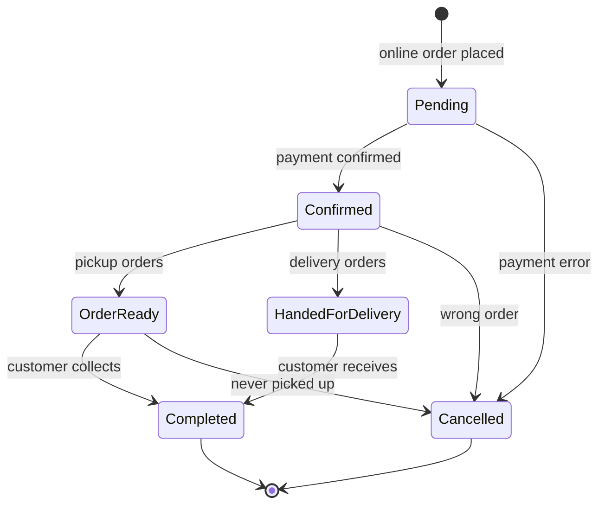

# Order lifecycle

How an order moves from creation to completion or cancellation, and the rules behind each step.

<!-- TODO: add the status names exactly as stored in the database, and update this file when the implementation changes -->

## Order scenarios

| #   | Scenario                             | Flow                                                  |
| --- | ------------------------------------ | ----------------------------------------------------- |
| 1   | Placed online, **pickup** at the gym | Pending → Confirmed → Order ready → Completed         |
| 2   | Placed online, **delivery**          | Pending → Confirmed → Handed for delivery → Completed |
| 3   | Placed **in store**, picked up       | Completed (a single state)                            |

Whether an order is pickup or delivery is determined by its shipping method (`pickup` or `standard_delivery`).

## Status flow

An order cannot be cancelled once it has been handed to the courier.

## Who changes the status

| Status              | Set by                                                                                                                                |
| ------------------- | ------------------------------------------------------------------------------------------------------------------------------------- |
| Pending             | System (when the order is created)                                                                                                    |
| Confirmed           | System, when payment is confirmed. For a bank transfer, this happens when the super admin approves the payment in the payment module. |
| Order ready         | Staff <!-- TODO: confirm -->                                                                                                          |
| Handed for delivery | Staff (order handed to the courier)                                                                                                   |
| Completed           | Staff                                                                                                                                 |
| Cancelled           | Staff, with a mandatory reason. Or the system, when online payment times out.                                                         |

## Transition rules

1. An order can only move to the **next** state. No skipping and no going back.
2. **Confirmed strictly means payment confirmed.** Nothing else moves an order into it.
3. Access to advance or cancel an order uses the existing `manage_orders` permission.

## Payment rules

| Rule                | Detail                                                                                                                                                                                                                                           |
| ------------------- | ------------------------------------------------------------------------------------------------------------------------------------------------------------------------------------------------------------------------------------------------ |
| Online orders       | Must be paid by **bank transfer or card**. No cash.                                                                                                                                                                                              |
| In-store orders     | Cash is allowed (cash is for in-store orders only).                                                                                                                                                                                              |
| Bank transfer       | Stays **Pending** until the super admin approves the payment. There is no timeout.                                                                                                                                                               |
| Online card payment | The customer goes to payment at checkout. Success moves the order to Confirmed. If payment fails, the order stays Pending for **1 day** so the customer can complete payment. After that it is cancelled with the reason "payment not received". |

Only bank transfers need super admin approval. Cash and card payments verify themselves.

**Why no cash for online orders:** a packaged order could otherwise wait indefinitely for a customer who may never come.

## Cancellation rules

- Allowed from **Pending**, **Confirmed**, and **Order ready**.
- **Not allowed** once an order is handed to the courier.
- A cancellation reason from the admin is **mandatory**.
- Cancellation is a **soft cancel**: the status changes to Cancelled, stock is restored, and the order record is kept for history. It applies to all roles, including admins.

## Data

| Decision               | Detail                                                                                                                                                         |
| ---------------------- | -------------------------------------------------------------------------------------------------------------------------------------------------------------- |
| Status timestamps      | Kept in a **status history table**, one row per status change, not as nullable timestamp columns on `orders`. This avoids null columns and normal form issues. |
| Delivery address       | Stored as columns directly on the `orders` table for now. It may move to its own table later if needed.                                                        |
| Order and payment link | `order_payments` links a payment to an order.                                                                                                                  |
| Stock                  | Decremented atomically when the order is placed, and restored on cancellation.                                                                                 |

## Not decided yet / future work

- **Returns and refunds:** to be handled later.
- **Uncollected paid pickup orders:** an idea of a 2-month collection limit, after which the company takes no responsibility for the order. Held until the supervisor has given feedback.
- **Member-facing cancellation:** deferred to the future customer PWA module.

## Placing an order

<!-- TODO: document the order placement steps (validation, stock check and decrement, creating the order, the payment record, the status history entry) once they are confirmed against the code -->
